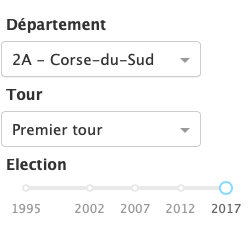
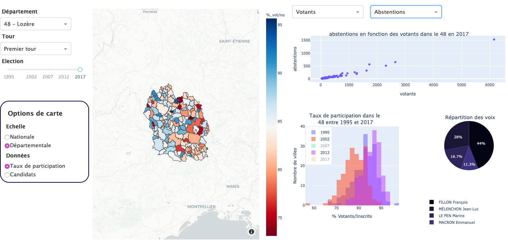

# Projet Python
Projet Python E3FI-2020 du premier semestre
Le dashboard représente les résultats des élections présidentielles françaises entre 1995 et 2017
## Présentation du Dashboard
### Utilisation de l'application
Une fois l'application lancée, vous aurez accès au Dashboard permettant de visualiser les différentes représentations des données. Divers composants permettent de modifier l'affichage des données, donnant ainsi une vision sur les résulats de toutes les communes et départements de France. 
  \
Ces options vous permettent de visualiser les données de chaque département voire de chaque commune (échelle spécifique à la carte).
Par défault, les premières données affichées sont celles de l'Ain, et le taux de participation à l'échelle nationale.
### Exemple de Dashboard
Le dashboard ci-dessous montre les données spécifiques à la Lozère en 2017. 


### Durée de chargement
Le chargement de la page peut prendre quelques minutes en fonction de la puissance de votre machine. Lorsque l'onglet de l'application dans le navigateur cesse d'afficher "Updating..." , les données que vous avez sélectionnées sont toutes affichées. 

## User guide
Ces instructions permettent de faire tourner l'application sur votre machine.
### Prérequis
S'assurer que python est bien installé sur votre machine. Si ce n'est pas le cas veuillez suivre les [instructions d'installation de python](https://www.python.org/downloads/). \
\
L'application utilise plusieurs modules de python qu'il faudra s'assuer d'avoir installé pour la faire fonctionner.
```
$ pip install plotly dash dash_core_components dash_html_components pandas json io urllib requests
```
### Installation de l'application
Pour installer l'application il suffit de cloner le projet, en exécutant la commande suivante : 
````
$ git clone https://git.esiee.fr/fouquoir/projet-python.git
````

L'application peut ensuite être lancée : \
Sur Linux ou Mac OS X 
````
$ cd /path/projet-python/
$ python3 main.py
````
Sur Windows :
`````
$ cd /path/projet-python/
$ python main.py
`````
L'application tourne sur le port 8051 donc il suffit de se rendre sur localhost:8051 dans le navigateur de votre choix.

## Developper guide


## Rapport d'analyse
### Présentation
Ce projet a pour but d'analyser les résultats des élections présidentielles en France métropolitaine en fonction des départements et villes. A travers les cartes choroplèthes et les graphiques, nous avons pu créer une application qui permet de mettre en avant les disparités des votes en fonction de la zone étudiée, ainsi que son orientation politique. Les résultats obtenus ont pu confirmer certaines de nos attentes, par exemple que l'Est parisien vote à gauche et l'Ouest à droite. D'autres résultats ont été plus surprenant, comme le fait que les deux départements Corse ont un taux de participation inférieur à 75% pour toutes les élections dont nous avons exploité les données.
Les résulats obtenus sont présentés ci-dessous, en deux temps d'abord les resultats pour le taux de participation, puis pour les candidats élus.

### Le taux de participation
Le taux de participation est illustré par une carte choroplèthe et un histogramme, accompagné d'un diagramme de points qui ensemble permettent de se donner une idée dans la participation aux élections des français. Ces données montrent l'implication des français dans la vie politique et les résultats que nous avons obtenus sont révélateurs en ce qui concerne le désintérêt de certaines régions face à une élection si importante. Si on reprend l'exemple de la Corse, en regardant le nombre d'abstentions en fonction du nombre de votants, on voit qu'en moyenne pour 10 votants on a 5 abstentions. Résultat reflété par la carte qui montre que la participation des haute et basse Corse reste bien en dessous de tous les autres départements de la métropole. 
### Les candidats 

### Conclusion


## Auteurs
Richard Fouquoire
Emily Renard